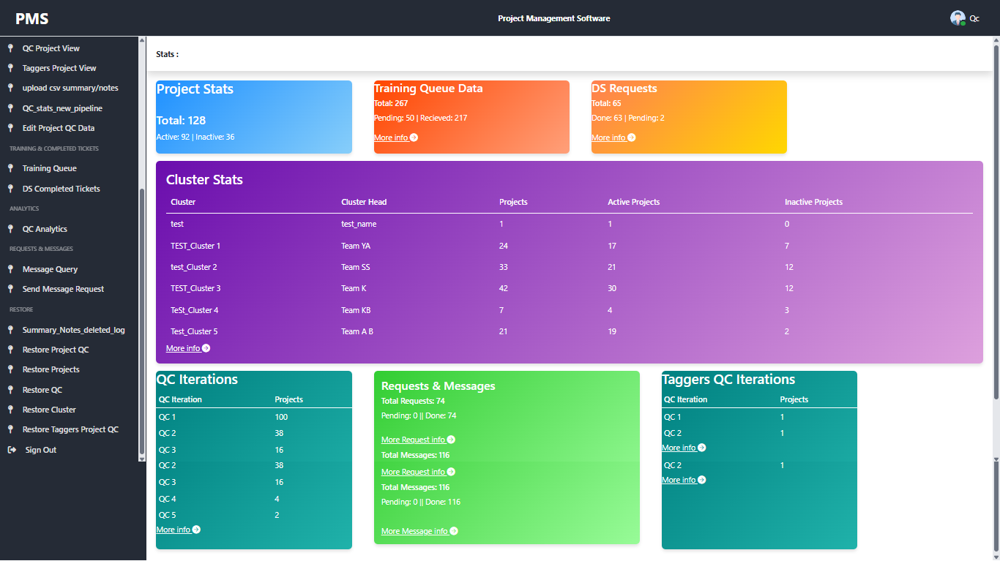
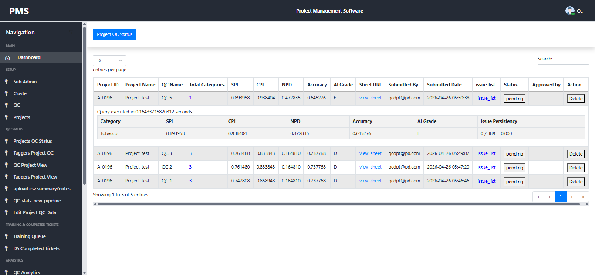
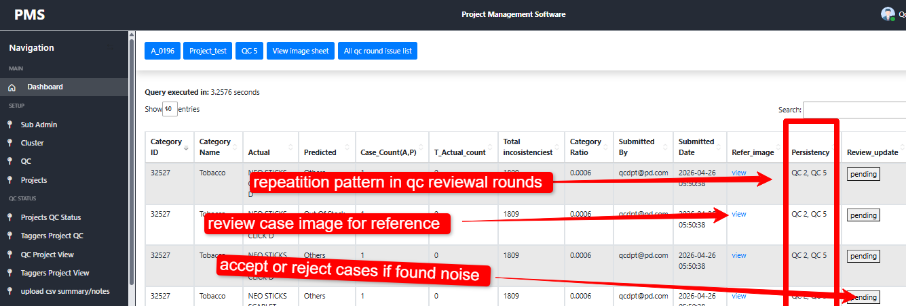

# 🚀 QC Portal – AI Model Reporting & Insight System  
Retail Analytics | QC Reporting & Data Intelligence Platform

A centralized reporting and analytics system designed to structure, analyze, and track QC outputs generated from manual image analysis, re-tagging, and AI model outputs in retail shelf workflows.

---

## 🔍 Context

In the existing workflow within the organization:

- Images are manually analyzed and re-tagged after review  
- Outputs from manual evaluation and AI model predictions are generated as QC reports  
- These reports were previously inconsistent, unstructured, and difficult to track across teams  

There was no unified system to:
- Standardize QC reporting  
- Track SKU-level inconsistencies  
- Identify recurring error patterns  
- Provide visibility into QC performance trends across projects  

---

## 💡 Solution

Built a QC Reporting & Insight Portal that transforms raw QC outputs into structured, actionable data:

- Centralized QC reporting dashboard for multiple projects  
- Custom transformation tool (Python + Streamlit) to process raw QC outputs into structured reports  
- Ingestion pipeline to load processed reports into QC Portal  
- Live tracking of metrics such as accuracy, deviations, and category performance  
- SKU-level and category-level issue tracking  
- Edge case detection with frequency analysis across multiple QC runs  
- Delete-proof system with instant data recovery capability  
- Cross-project dashboards for pattern detection and trend analysis  

---

## 🔄 Workflow

1. Manual image analysis and re-tagging generates QC output  
2. Raw output is processed using the custom transformation tool (Python + Streamlit)  
3. Structured QC report is generated  
4. Data is ingested into the QC Portal  
5. QC Portal provides metrics, insights, and pattern-based analysis  

---

## 📊 Key Capabilities

- Standardized QC reporting across teams  
- Identification of error-prone / vulnerable SKUs  
- Detection of recurring patterns across QC cycles  
- Visibility into accuracy and deviation trends  
- Centralized tracking of QC performance across multiple projects  

---
## 📸 Screenshots

### 📊 Dashboard Overview

---

### 📁 Project-Level Statistics

---

### 🔍 SKU-Level Insights & Patterns

## 📈 Impact

- Started as a self-hosted internal tool (2024) to streamline personal QC tracking workflows  
- Later adopted and deployed on company infrastructure (2026) due to its operational value  
- Improved reporting consistency and visibility across teams  
- Reduced manual effort in consolidating and interpreting QC outputs  
- Enabled faster pattern detection and decision-making through structured insights  

---

## 🛠️ Tech Stack

QC Portal (Reporting & Insights Layer)  
- PHP  
- JavaScript (AJAX)  
- SQL  
{ LAMP Stack  }

Transformation Layer  
- Python  
- Streamlit  

---

## ⚡ One-line Summary
Designed and productionized an end-to-end QC reporting system that converts manual evaluation outputs into structured, actionable insights for monitoring model performance, deviations, and SKU-level patterns across retail datasets.

## 📄 License
This project is licensed under the MIT License.